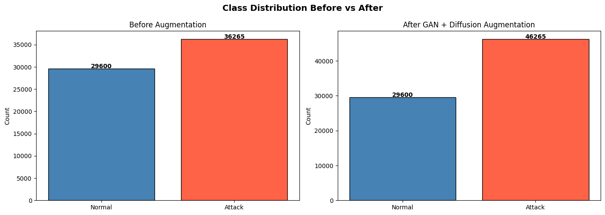
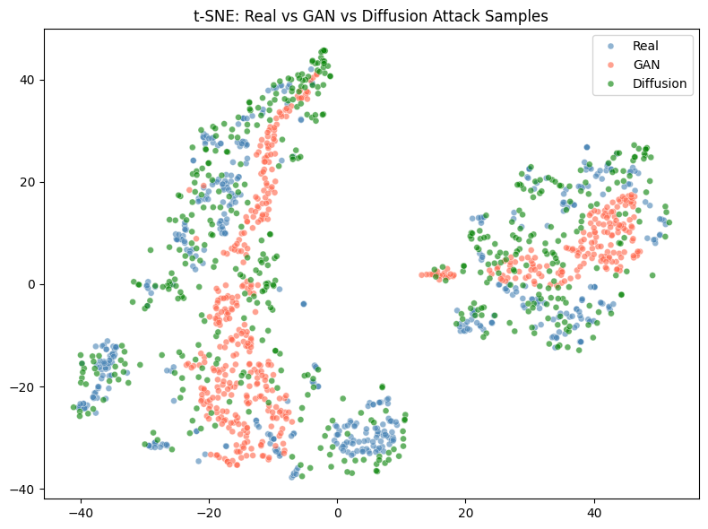
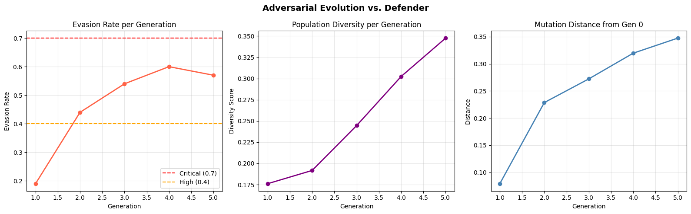
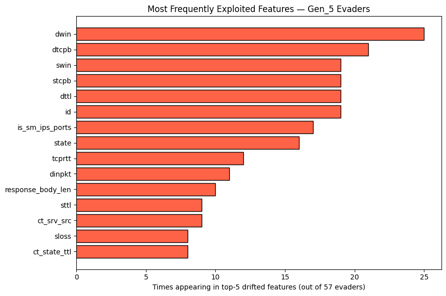

# Adversarial Robustness Evaluation of ML-based Intrusion Detection

A  project investigating why static, single-shot ML classifiers are insufficient for real-world network intrusion detection ,by building a GAN + diffusion-model pipeline that adversarially evolves attack traffic and systematically probes a trained detector for blind spots.

---


A neural intrusion detector scored **99.9% AUC** on unperturbed test data — but when attack traffic was adversarially evolved over 5 generations (GAN-generated, then diffusion-mutated, with survivor selection), evasion rate climbed to **57–60%**, reproduced consistently across 3 independent random seeds. Feature-attribution analysis traced the evasion almost entirely to a small cluster of **TCP window-size and sequence-number fields** — showing the model's weakness is specific and exploitable, not diffuse. A secondary experiment found that naively augmenting training data with GAN/diffusion-generated samples did **not** improve detection, nuancing the conclusion: robustness requires targeted defenses, not just more synthetic data.

---

## Motivation

ML-based intrusion detection systems (IDS) are commonly evaluated on static, held-out test sets — and often report near-perfect accuracy. But real attackers adapt. A classifier that scores 99%+ on unmodified traffic can still be brittle if a small, targeted perturbation reliably slips past it. This project asks: **can we quantify that gap, and can we identify exactly where the model is weak?**

## Dataset

[UNSW-NB15](https://research.unsw.edu.au/projects/unsw-nb15-dataset) — a widely used academic network intrusion dataset containing labeled real and synthetic network traffic across 9 attack categories plus normal traffic, with 45 flow-level features per record (e.g. duration, protocol, TCP window sizes, packet/byte counts, TTLs).

Loaded via [Kaggle](https://www.kaggle.com/datasets/mrwellsdavid/unsw-nb15) (`mrwellsdavid/unsw-nb15`). Not included in this repo — the notebook downloads it automatically via `kagglehub`.

## Methodology

**1. Preprocessing**
Categorical features label-encoded, numeric features scaled to `[-1, 1]` via `MinMaxScaler` (chosen to match the generator's `Tanh` output range), stratified 80/20 train/test split.

**2. Attack Generator — WGAN**
A Wasserstein GAN (weight-clipped critic, 5:1 critic-to-generator training ratio) trained on real attack samples to synthesize realistic attack feature vectors.

**3. Attack Mutator — Diffusion Model**
A DDPM-style diffusion model, trained to denoise attack samples, repurposed to *gradually mutate* existing samples via guided reverse-diffusion steps — mutations are clamped to `[-1, 1]` at every step, keeping evolved samples within the same bounds real data occupies (rather than drifting into unrealistic feature space).

**4. Defender — Neural Classifier**
A feed-forward network trained to classify traffic as attack/normal, evaluated on a held-out real test set.

**5. Adversarial Evolution Loop**
- Generation 0: WGAN generates an initial population of attack samples
- Each generation: diffusion-guided mutation → scored against the Defender → top 50% evaders survive → refilled with 50% fresh GAN samples → repeat for 5 generations
- Tracked: evasion rate, population diversity, mutation distance from generation 0

**6. Feature-Level Diagnosis**
For each evading sample, identified which features drifted most from their generation-0 values, then aggregated across all evaders to find the most frequently exploited features.

## Key Results

### Evasion rate climbs and plateaus across generations (reproduced across 3 seeds)

| Generation | Evasion Rate |
|---|---|
| 1 | 19% |
| 2 | 44% |
| 3 | 54% |
| 4 | 60% |
| 5 | 57% |

### The evasion is concentrated in a specific, interpretable feature cluster

| Feature | % of evaders exploiting it |
|---|---|
| `dwin` (destination TCP window size) | 43.9% |
| `dtcpb` (destination TCP base seq #) | 36.8% |
| `swin` (source TCP window size) | 33.3% |
| `stcpb` (source TCP base seq #) | 33.3% |
| `dttl` (destination TTL) | 33.3% |

TCP window-size and sequence-number manipulation is a documented real-world IDS evasion technique — this result suggests the model reproduces a known, not merely synthetic, weakness.

### Defender performance: clean test set vs. adversarially evolved traffic

| | Held-out test set (unperturbed) | Generation 5 (evolved) |
|---|---|---|
| Real-only defender | AUC 0.9993, Recall 0.9963 | — |
| Real + synthetic defender | AUC 0.9988, Recall 0.9940 | Evasion rate: 57% |

### Negative result: naive data augmentation did not improve detection

Training the Defender on real + GAN/diffusion-synthetic data performed *slightly worse* on every held-out metric (precision, recall, F1, AUC) than training on real data alone — the synthetic samples likely added mild label noise rather than genuinely new decision-boundary information, since they weren't targeted at the model's actual weak spot.

**Plots/Visulaizations**


## Conclusion

High accuracy on a static benchmark does not imply robustness. A classifier can be near-perfect on unmodified data while still having a narrow, exploitable blind spot that an adversarial process can reliably find and expand. This motivates adaptive, targeted, or ensemble-based detection approaches — and shows that blind data augmentation is not a substitute for understanding *where* a model is actually weak.

---
## Results — Plots

| | |
|---|---|
|  |  |
|  |  |


---
**How to Use**
**Option A — Run in Google Colab (easiest, no local setup)**

- Click into adversarial_ids_robustness.ipynb in this repo on GitHub.
- Click the "Open in Colab" badge at the top of the notebook (or go to colab.research.google.com → File → Open notebook → GitHub tab → paste this repo's URL).
-- In Colab: Runtime → Run all. The dataset downloads automatically via kagglehub on first run — you'll be prompted to authenticate with a free Kaggle account the first time.
-- Full run (WGAN + diffusion training + evolution loop) takes roughly 15–30 minutes depending on whether Colab assigns you a GPU (Runtime → Change runtime type → GPU to speed this up significantly).

### Option B — Run locally

1. **Clone the repo:**
   ```bash
   git clone https://github.com/<aasrithavalluri30-source>/<Adversarial-Robustness-Evaluation-of-ML-based-Network-Intrusion-Detection>.git
   cd <Adversarial-Robustness-Evaluation-of-ML-based-Network-Intrusion-Detection>
   ```

2. **(Recommended) create a virtual environment:**
   ```bash
   python -m venv venv
   source venv/bin/activate      # on Windows: venv\Scripts\activate
   ```

3. **Install dependencies:**
   ```bash
   pip install -r requirements.txt
   pip install jupyter          # if you don't already have it
   ```

4. **Set up Kaggle access** (needed for the dataset download):
   - Create a free account at [kaggle.com](https://www.kaggle.com)
   - Go to Account Settings → API → "Create New Token" to download `kaggle.json`
   - Place it at `~/.kaggle/kaggle.json` (Mac/Linux) or `C:\Users\<you>\.kaggle\kaggle.json` (Windows)

5. **Launch and run:**
   ```bash
   jupyter notebook adversarial_ids_robustness.ipynb
   ```
   Then run all cells top to bottom (Kernel → Restart & Run All).

## Tech Stack

Python · PyTorch · Scikit-learn · Pandas · NumPy · Matplotlib · Seaborn · Kagglehub

